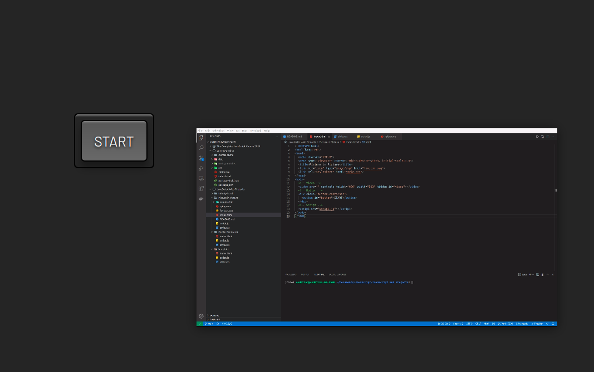

# Picture in Picture

---

[Browser Support](https://caniuse.com/picture-in-picture "Which Browsers support Picture-in-Picture")

---

---

The Picture in Picture and the Screen Capture APIs are being used in this project.